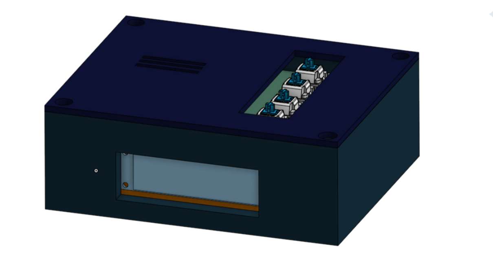
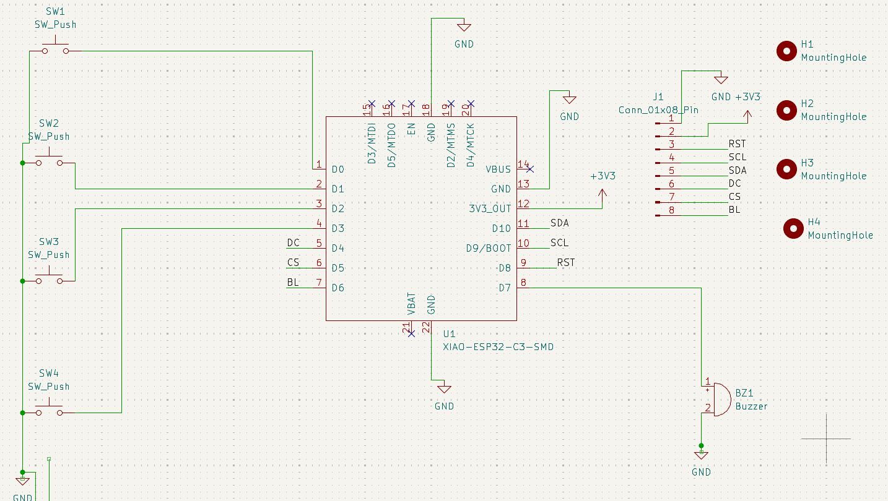
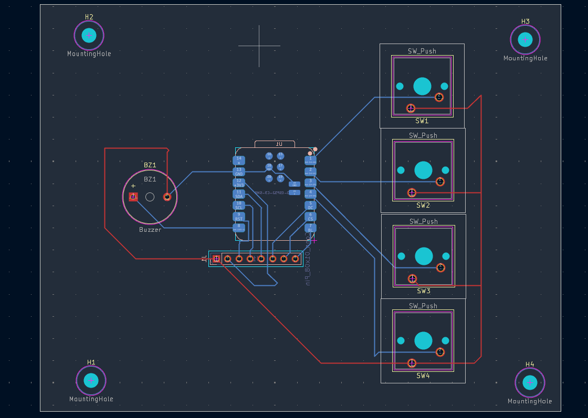
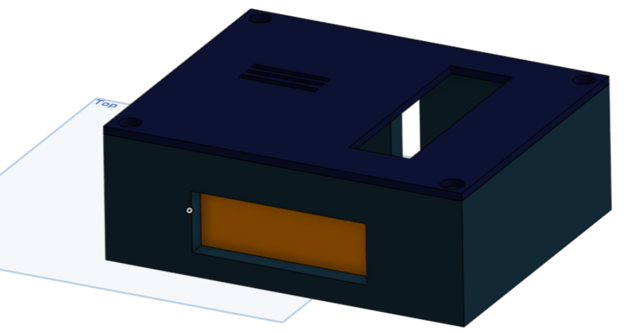

# Blare_Alarm_v1 - ESP32-C3 Hardware Project

Welcome to the complete repository for the Blare Alarm project. This project a fully custom hardware layout driven by an ESP32-C3 microcontroller, custom enclosure CAD models, and production-ready manufacturing files.

---

## 📸 Project Showcase

### Overall Clock Design

### Circuit Schematic

### PCB Board Layout

### Enclosure & Integration Fit

---

## 📃 Bill of Materials (BOM)

| Component Description | Quantity | Package /Type | Notes |
| :--- | :--- | :--- | :--- |
| ESP32-C3 Microcontroller | 1 | Custom Footprint | Main system processor |
| Mechanical Keyboard Switches | 4 | 2-Pin Through-Hole (PTH) | Input keys for interface |
| Matching Keycaps | 4 | Plastic Caps | Fitted onto mechanical switches |
| 3.3V Buzzer | 1 | Through-Hole (PTH) | Mounted on PCB for alarm audio |
| 2.25in TFT Display | 1 | Screen Module | Main clock screen interface |
| Custom Enclosure Case | 1 | 3D Printed (STEP Model) | Physical shell designed in Onshape |

---

## 📂 Repository Organization
* **`CAD/`**: Core 3D chassis design models.
* **`Firmware/`**: Target Arduino application source code.
* **`PCB/`**: Portable KiCad source designs with isolated, project-relative footprint libraries.
* **`Production/`**: Factory-ready `gerbers.zip` manufacturing archive.

